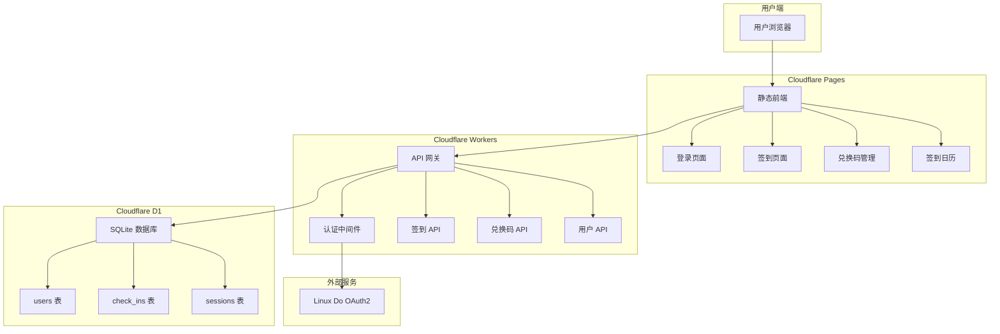
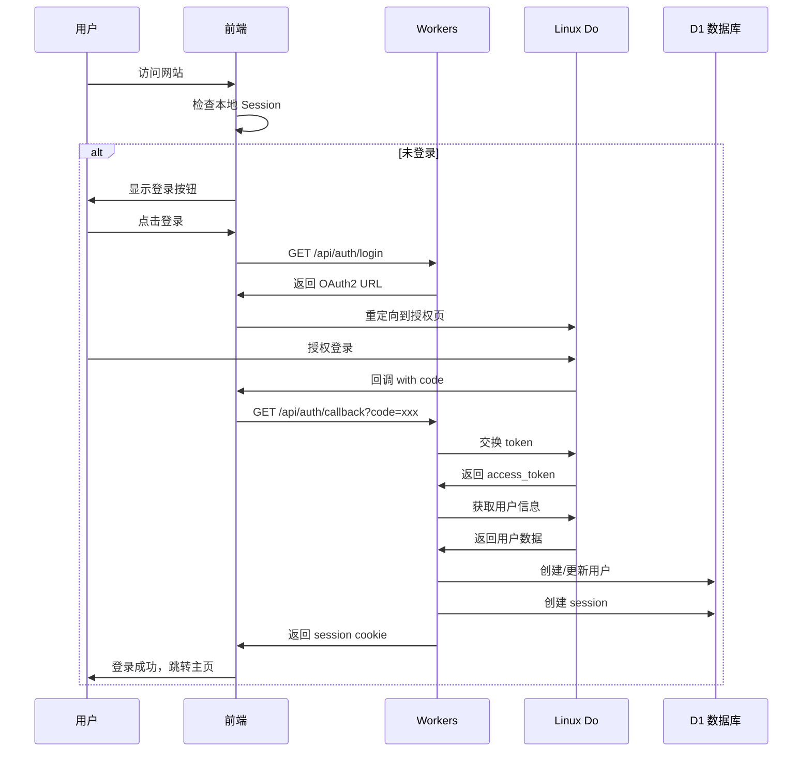
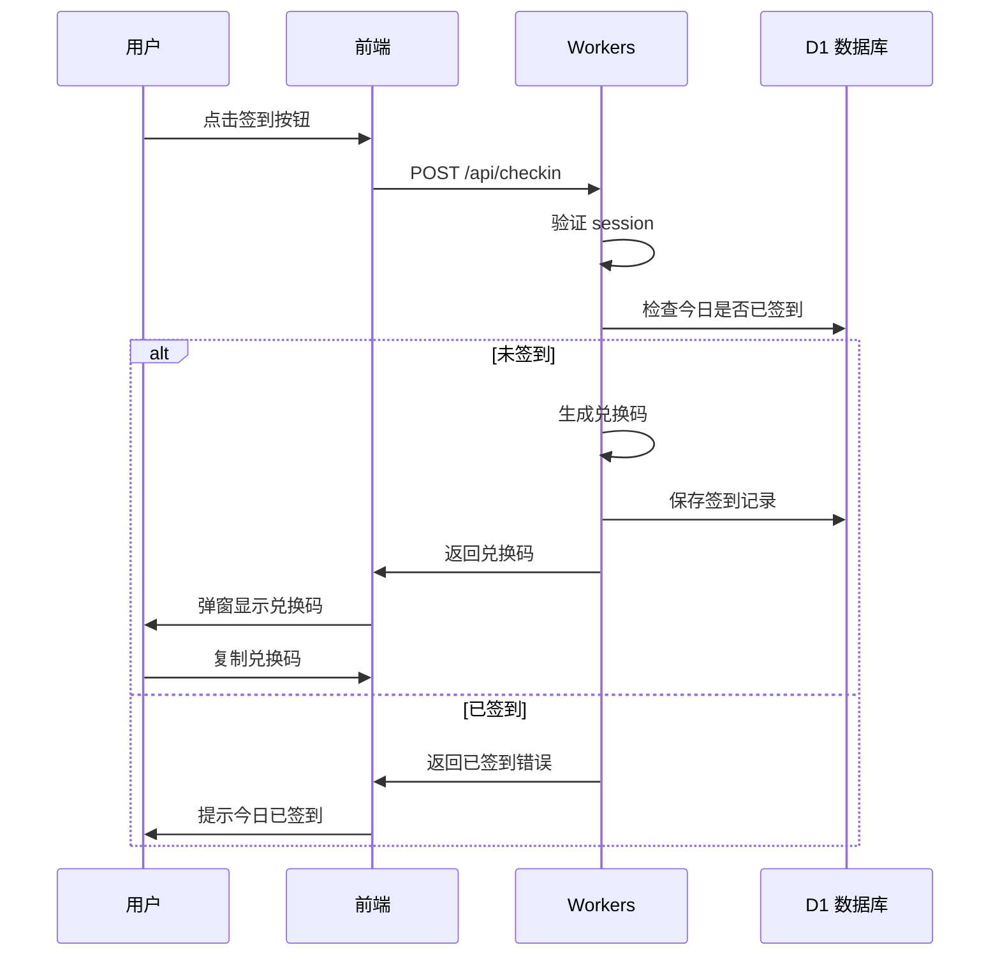

# 签到兑换码系统架构设计

## 系统概述

这是一个基于 Cloudflare 生态系统的签到兑换码系统，使用 Linux Do OAuth2 进行用户认证。

## 技术栈

- **前端**: Cloudflare Pages (原生 HTML/CSS/JavaScript)
- **后端**: Cloudflare Workers (无服务器函数)
- **数据库**: Cloudflare D1 (SQLite)
- **认证**: Linux Do OAuth2
- **部署**: Cloudflare

## 系统架构图



## 数据库设计

### users 表
```sql
CREATE TABLE users (
    id INTEGER PRIMARY KEY AUTOINCREMENT,
    linux_do_id TEXT UNIQUE NOT NULL,
    username TEXT NOT NULL,
    email TEXT,
    avatar_url TEXT,
    created_at DATETIME DEFAULT CURRENT_TIMESTAMP,
    updated_at DATETIME DEFAULT CURRENT_TIMESTAMP
);
```

### check_ins 表
```sql
CREATE TABLE check_ins (
    id INTEGER PRIMARY KEY AUTOINCREMENT,
    user_id INTEGER NOT NULL,
    check_in_date DATE NOT NULL,
    redemption_code TEXT UNIQUE NOT NULL,
    created_at DATETIME DEFAULT CURRENT_TIMESTAMP,
    FOREIGN KEY (user_id) REFERENCES users(id),
    UNIQUE(user_id, check_in_date)
);
```

### sessions 表
```sql
CREATE TABLE sessions (
    id TEXT PRIMARY KEY,
    user_id INTEGER NOT NULL,
    expires_at DATETIME NOT NULL,
    created_at DATETIME DEFAULT CURRENT_TIMESTAMP,
    FOREIGN KEY (user_id) REFERENCES users(id)
);
```

## API 端点设计

### 认证相关
- `GET /api/auth/login` - 获取 OAuth2 授权 URL
- `GET /api/auth/callback` - OAuth2 回调处理
- `POST /api/auth/logout` - 登出
- `GET /api/auth/me` - 获取当前用户信息

### 签到相关
- `POST /api/checkin` - 执行签到
- `GET /api/checkin/today` - 检查今日是否已签到
- `GET /api/checkin/calendar` - 获取签到日历数据

### 兑换码相关
- `GET /api/codes` - 获取用户的所有兑换码
- `GET /api/codes/:id` - 获取特定兑换码详情

## 项目目录结构

```
-Newapi-Sign-in-system/
├── frontend/                    # 前端代码（Cloudflare Pages）
│   ├── index.html              # 主页/签到页面
│   ├── codes.html              # 兑换码管理页面
│   ├── login.html              # 登录页面
│   ├── css/
│   │   └── style.css           # 全局样式
│   ├── js/
│   │   ├── app.js             # 主应用逻辑
│   │   ├── auth.js            # 认证相关
│   │   ├── checkin.js         # 签到功能
│   │   ├── calendar.js        # 日历组件
│   │   └── codes.js           # 兑换码管理
│   └── assets/
│       └── icons/             # 图标资源
│
├── backend/                    # 后端代码（Cloudflare Workers）
│   ├── src/
│   │   ├── index.js           # Workers 入口
│   │   ├── routes/
│   │   │   ├── auth.js        # 认证路由
│   │   │   ├── checkin.js     # 签到路由
│   │   │   └── codes.js       # 兑换码路由
│   │   ├── middleware/
│   │   │   └── auth.js        # 认证中间件
│   │   ├── utils/
│   │   │   ├── db.js          # 数据库工具
│   │   │   ├── oauth.js       # OAuth2 工具
│   │   │   └── code.js        # 兑换码生成
│   │   └── schema.sql         # 数据库架构
│   └── wrangler.toml          # Workers 配置
│
├── scripts/
│   ├── init-db.js             # 初始化数据库脚本
│   └── deploy.sh              # 部署脚本
│
├── .env.example               # 环境变量示例
├── README.md                  # 项目说明
└── architecture.md            # 架构文档（本文件）
```

## 核心功能流程

### 1. 用户登录流程



### 2. 签到流程



## 安全考虑

1. **Session 管理**
   - 使用 httpOnly cookie 存储 session ID
   - Session 有效期设置为 7 天
   - 每次请求验证 session 有效性

2. **CORS 配置**
   - 仅允许来自部署域名的请求
   - 严格限制允许的 HTTP 方法

3. **数据验证**
   - 所有输入进行严格验证
   - 使用参数化查询防止 SQL 注入

4. **兑换码安全**
   - 使用加密安全的随机数生成器
   - 兑换码格式：XXXX-XXXX-XXXX-XXXX

## 部署流程

1. 在 Linux Do 创建 OAuth2 应用
2. 配置环境变量
3. 初始化 D1 数据库
4. 部署 Workers 后端
5. 部署 Pages 前端
6. 配置自定义域名（可选）