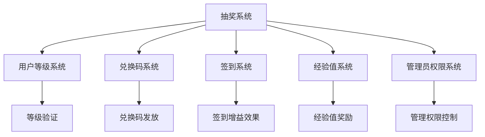
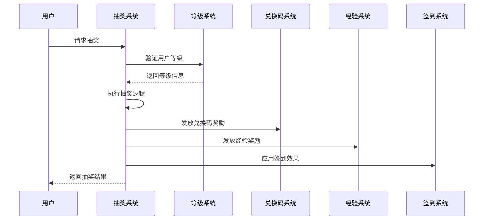

# 秘境抽奖系统集成方案

## 1. 系统集成架构

### 1.1 集成点概览


### 1.2 数据流向图


## 2. 与现有系统的集成点

### 2.1 用户等级系统集成

#### 2.1.1 等级验证
- **集成点**: `user_levels` 表
- **功能**: 验证用户是否满足转盘等级要求
- **实现方式**: 
  ```sql
  SELECT ul.id, ul.level_name 
  FROM users u 
  JOIN user_levels ul ON u.level = ul.id 
  WHERE u.id = ? AND ul.id >= ? AND ul.id <= ?
  ```

#### 2.1.2 经验值奖励集成
- **集成点**: `UserLevelSystem.addUserExperience()` 方法
- **功能**: 发放经验值奖励，自动触发升级检查
- **实现方式**: 调用现有经验值添加接口

### 2.2 兑换码系统集成

#### 2.2.1 兑换码发放
- **集成点**: `redemption_codes` 表
- **功能**: 自动生成并分配兑换码给用户
- **实现方式**:
  ```sql
  UPDATE redemption_codes 
  SET is_distributed = TRUE, distributed_to = ?, distributed_at = ?, 
      distributed_by = ?, distribution_type = 'lottery'
  WHERE is_distributed = FALSE AND amount = ? 
  LIMIT 1
  ```

#### 2.2.2 兑换码库存检查
- **功能**: 确保有足够的兑换码可供发放
- **实现方式**: 抽奖前检查对应金额的可用兑换码数量

### 2.3 签到系统集成

#### 2.3.1 签到增益效果
- **集成点**: 签到经验计算逻辑
- **功能**: 在签到时应用抽奖获得的增益效果
- **实现方式**: 修改签到经验计算，检查活跃的签到效果

#### 2.3.2 效果应用逻辑
```javascript
async function calculateSigninExperienceWithEffects(userId, baseExperience) {
  const activeEffects = await getActiveSigninEffects(userId);
  let finalExperience = baseExperience;
  
  for (const effect of activeEffects) {
    if (effect.effect_type === 'signin_effect') {
      finalExperience *= effect.effect_multiplier;
    }
  }
  
  return Math.floor(finalExperience);
}
```

### 2.4 管理员权限系统集成

#### 2.4.1 权限验证
- **集成点**: `checkAdminPermission()` 函数
- **功能**: 验证管理员是否有抽奖系统管理权限
- **新增权限类型**:
  - `lottery_config`: 抽奖配置管理
  - `lottery_prizes`: 奖品池管理
  - `lottery_stats`: 抽奖统计查看

## 3. 数据库集成策略

### 3.1 表关系设计
- **外键约束**: 确保数据一致性
- **级联删除**: 合理设置级联规则
- **索引优化**: 针对关联查询优化索引

### 3.2 事务处理
```javascript
async function executeLotteryWithTransaction(userId, wheelConfigId) {
  const transaction = await db.beginTransaction();
  try {
    // 1. 验证用户状态
    const userStatus = await verifyUserStatus(userId, transaction);
    
    // 2. 执行抽奖逻辑
    const lotteryResult = await performLottery(wheelConfigId, transaction);
    
    // 3. 发放奖励
    await deliverReward(userId, lotteryResult.prize, transaction);
    
    // 4. 更新统计数据
    await updateLotteryStats(userId, wheelConfigId, transaction);
    
    await transaction.commit();
    return lotteryResult;
  } catch (error) {
    await transaction.rollback();
    throw error;
  }
}
```

## 4. API集成方案

### 4.1 路由集成
在现有 `workers-admin-super.js` 中添加抽奖路由：

```javascript
// 在 handleApiRequest 函数中添加
if (pathParts[0] === 'lottery') {
  return await handleLotteryApi(request, env, pathParts, method, session);
}
```

### 4.2 权限中间件
```javascript
async function checkLotteryPermission(env, adminId, action) {
  const permissionMap = {
    'view_config': 'lottery_config',
    'edit_config': 'lottery_config',
    'manage_prizes': 'lottery_prizes',
    'view_stats': 'lottery_stats'
  };
  
  return await checkAdminPermission(env, adminId, permissionMap[action], 'read');
}
```

## 5. 前端集成方案

### 5.1 界面集成
在现有管理后台添加抽奖管理标签页：

```html
<!-- 在现有标签页中添加 -->
<div class="tab" onclick="showTab('lottery')">🎰 抽奖管理</div>

<!-- 抽奖管理内容区域 -->
<div id="lottery" class="tab-content">
  <div class="lottery-management">
    <!-- 奖品池管理 -->
    <!-- 转盘配置 -->
    <!-- 统计数据 -->
  </div>
</div>
```

### 5.2 JavaScript集成
```javascript
// 添加抽奖相关函数
async function loadLotteryConfig() {
  // 加载抽奖配置
}

async function managePrizePool() {
  // 管理奖品池
}

async function viewLotteryStats() {
  // 查看抽奖统计
}
```

## 6. 部署和迁移策略

### 6.1 数据库迁移步骤
1. **备份现有数据库**
2. **执行抽奖系统建表脚本**
3. **插入初始配置数据**
4. **验证表结构和关联关系**
5. **测试基础功能**

### 6.2 代码部署步骤
1. **添加抽奖系统核心类**
2. **集成API路由处理**
3. **更新前端界面**
4. **配置管理员权限**
5. **进行功能测试**

### 6.3 回滚方案
- **数据库回滚**: 删除抽奖相关表，恢复备份
- **代码回滚**: 移除抽奖相关代码，恢复原版本
- **配置回滚**: 清理抽奖相关配置项

## 7. 测试策略

### 7.1 单元测试
- 抽奖概率算法测试
- 保底机制测试
- 奖励发放测试
- 效果应用测试

### 7.2 集成测试
- 用户等级验证测试
- 兑换码发放测试
- 签到增益效果测试
- 管理员权限测试

### 7.3 性能测试
- 并发抽奖测试
- 大量数据查询测试
- 数据库性能测试

## 8. 监控和维护

### 8.1 监控指标
- 抽奖成功率
- 奖励发放成功率
- 系统响应时间
- 错误率统计

### 8.2 日志记录
- 抽奖操作日志
- 奖励发放日志
- 错误异常日志
- 性能监控日志

### 8.3 定期维护
- 清理过期效果
- 归档历史数据
- 优化数据库性能
- 更新系统配置
