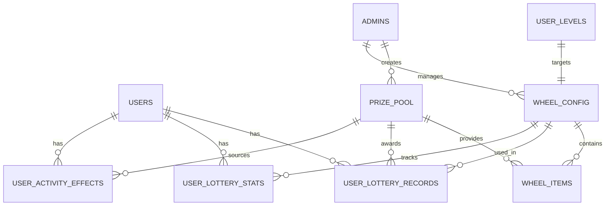

# 秘境抽奖系统详细设计文档

## 1. 系统概述

### 1.1 设计目标
基于现有KYX签到系统，设计并实现一个完整的分级抽奖系统，为13个用户等级提供差异化的抽奖体验，通过大转盘形式提供多样化的奖励和适度的惩罚机制。

### 1.2 核心特性
- **分级管理**: 13个等级专属转盘配置
- **概率控制**: 精确的概率算法和保底机制
- **多样奖励**: 兑换码、经验值、签到增益等
- **时效效果**: 支持临时性增益/减益效果
- **完整集成**: 与现有系统无缝集成

### 1.3 技术架构
- **后端**: 基于现有Cloudflare Workers架构
- **数据库**: SQLite (D1) 扩展现有表结构
- **前端**: 集成到现有管理后台
- **API**: RESTful接口设计

## 2. 业务逻辑设计

### 2.1 抽奖核心算法

#### 2.1.1 概率计算算法
```javascript
class LotteryEngine {
  calculateWinningItem(wheelItems, pityCounter, pityThreshold) {
    // 检查是否触发保底
    if (pityCounter >= pityThreshold) {
      return this.getPityItem(wheelItems);
    }
    
    // 正常概率计算
    const totalWeight = wheelItems.reduce((sum, item) => sum + item.probability, 0);
    const randomValue = Math.random() * totalWeight;
    
    let currentWeight = 0;
    for (const item of wheelItems) {
      currentWeight += item.probability;
      if (randomValue <= currentWeight) {
        return item;
      }
    }
    
    // 兜底返回第一个物品
    return wheelItems[0];
  }
  
  getPityItem(wheelItems) {
    // 返回稀有度最高的物品作为保底
    return wheelItems
      .filter(item => ['epic', 'legendary'].includes(item.prize.prize_rarity))
      .sort((a, b) => this.getRarityWeight(b.prize.prize_rarity) - this.getRarityWeight(a.prize.prize_rarity))[0];
  }
  
  getRarityWeight(rarity) {
    const weights = { 'common': 1, 'rare': 2, 'epic': 3, 'legendary': 4 };
    return weights[rarity] || 1;
  }
}
```

#### 2.1.2 保底机制设计
- **触发条件**: 连续N次未获得稀有物品
- **重置条件**: 获得epic或legendary物品时重置
- **保底物品**: 每个转盘配置指定的保底奖品
- **计数维护**: 按用户+转盘维度独立计数

### 2.2 奖励发放机制

#### 2.2.1 兑换码发放流程
```javascript
async function distributeRedemptionCode(userId, amount) {
  // 1. 查找可用兑换码
  const availableCode = await env.DB.prepare(`
    SELECT id, code FROM redemption_codes 
    WHERE is_distributed = FALSE AND amount = ? 
    ORDER BY created_at ASC LIMIT 1
  `).bind(amount).first();
  
  if (!availableCode) {
    throw new Error('暂无可用兑换码');
  }
  
  // 2. 分配给用户
  await env.DB.prepare(`
    UPDATE redemption_codes 
    SET is_distributed = TRUE, distributed_to = ?, 
        distributed_at = ?, distribution_type = 'lottery'
    WHERE id = ?
  `).bind(userId, getUTC8TimestampString(), availableCode.id).run();
  
  return availableCode;
}
```

#### 2.2.2 经验值发放流程
```javascript
async function distributeExperience(userId, amount, isPositive = true) {
  const finalAmount = isPositive ? Math.abs(amount) : -Math.abs(amount);
  
  // 调用现有经验系统
  await levelSystem.addUserExperience(
    userId, 
    finalAmount, 
    'lottery_reward', 
    `抽奖${isPositive ? '获得' : '失去'}${Math.abs(amount)}点经验`
  );
}
```

#### 2.2.3 签到效果应用
```javascript
async function applySigninEffect(userId, prizeId, effectMultiplier, duration) {
  const endTime = duration > 0 ? 
    new Date(Date.now() + duration * 60 * 60 * 1000).toISOString() : null;
  
  await env.DB.prepare(`
    INSERT INTO user_activity_effects 
    (user_id, effect_type, effect_value, effect_multiplier, 
     source_prize_id, start_time, end_time, description)
    VALUES (?, 'signin_effect', 0, ?, ?, ?, ?, ?)
  `).bind(
    userId, effectMultiplier, prizeId, 
    getUTC8TimestampString(), endTime,
    `签到经验${effectMultiplier > 1 ? '增益' : '减益'}效果`
  ).run();
}
```

### 2.3 转盘配置验证

#### 2.3.1 概率验证规则
```javascript
function validateWheelProbabilities(wheelItems) {
  const totalProbability = wheelItems.reduce((sum, item) => sum + item.probability, 0);
  
  if (totalProbability !== 100) {
    throw new Error(`概率总和必须为100%，当前为${totalProbability}%`);
  }
  
  // 检查是否有稀有物品
  const hasRareItem = wheelItems.some(item => 
    ['epic', 'legendary'].includes(item.prize.prize_rarity)
  );
  
  if (!hasRareItem) {
    throw new Error('转盘必须包含至少一个稀有物品');
  }
  
  return true;
}
```

## 3. 数据模型设计

### 3.1 核心实体关系


### 3.2 数据完整性约束
- **外键约束**: 确保引用完整性
- **检查约束**: 验证数据有效性
- **唯一约束**: 防止重复数据
- **非空约束**: 确保必要字段

### 3.3 索引策略
- **主键索引**: 自动创建
- **外键索引**: 优化关联查询
- **复合索引**: 优化复杂查询条件
- **部分索引**: 针对特定条件优化

## 4. 接口设计规范

### 4.1 API设计原则
- **RESTful风格**: 遵循REST设计规范
- **统一响应格式**: 标准化响应结构
- **错误处理**: 完善的错误码体系
- **版本控制**: 支持API版本管理

### 4.2 认证授权
- **用户认证**: 复用现有session机制
- **权限控制**: 基于角色的访问控制
- **安全验证**: 防止越权操作

### 4.3 数据验证
- **输入验证**: 严格的参数校验
- **业务验证**: 业务规则检查
- **数据清洗**: 防止恶意输入

## 5. 性能优化设计

### 5.1 数据库优化
- **查询优化**: 合理使用索引
- **连接池**: 复用数据库连接
- **事务控制**: 最小化事务范围
- **批量操作**: 减少数据库交互

### 5.2 缓存策略
- **配置缓存**: 缓存转盘配置数据
- **用户状态缓存**: 缓存用户抽奖状态
- **统计数据缓存**: 缓存计算结果

### 5.3 并发控制
- **乐观锁**: 处理并发更新
- **分布式锁**: 防止重复抽奖
- **队列机制**: 处理高并发请求

## 6. 安全设计

### 6.1 数据安全
- **SQL注入防护**: 参数化查询
- **XSS防护**: 输出编码
- **CSRF防护**: Token验证

### 6.2 业务安全
- **频率限制**: 防止刷奖行为
- **权限验证**: 严格的权限检查
- **操作日志**: 完整的审计日志

### 6.3 系统安全
- **输入验证**: 严格的数据校验
- **错误处理**: 安全的错误信息
- **监控告警**: 异常行为检测

## 7. 监控和运维

### 7.1 监控指标
- **业务指标**: 抽奖成功率、奖励发放率
- **性能指标**: 响应时间、吞吐量
- **错误指标**: 错误率、异常统计

### 7.2 日志管理
- **操作日志**: 记录关键操作
- **错误日志**: 记录异常信息
- **性能日志**: 记录性能数据

### 7.3 运维工具
- **健康检查**: 系统状态监控
- **配置管理**: 动态配置更新
- **数据备份**: 定期数据备份

## 8. 扩展性设计

### 8.1 功能扩展
- **新奖品类型**: 支持新的奖励类型
- **新转盘模式**: 支持不同的抽奖模式
- **活动系统**: 支持限时活动

### 8.2 性能扩展
- **水平扩展**: 支持多实例部署
- **数据分片**: 支持数据库分片
- **缓存扩展**: 支持分布式缓存

### 8.3 集成扩展
- **第三方集成**: 支持外部系统集成
- **API扩展**: 支持更多API接口
- **插件机制**: 支持功能插件
